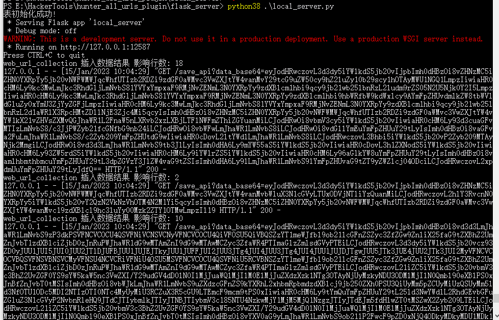
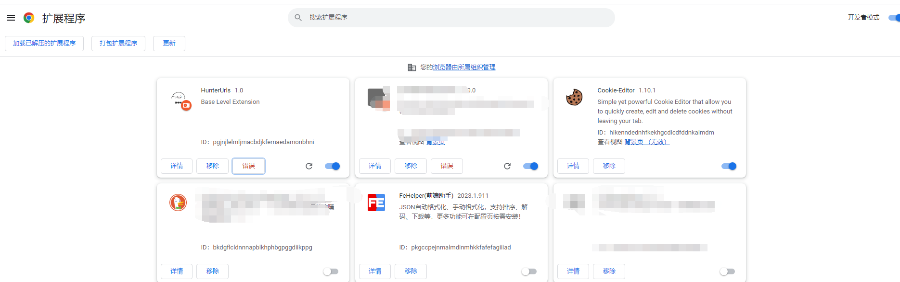

# HunterUrls

>介绍:
HunterUrls是一个前端url采集工具，目的是为了在测试网站时一键收集前端渲染后的url，核心意图与FindSomething插件差不多，但采集方式不同。脚本的运行逻辑也比较浅显。谷歌插件启动作为客户端进行数据采集，flask接口作为服务端进行数据存储。目前只支持mysql和csv存储形式。如有更好的建议，请联系VX:Captian0XX，希望能收到您宝贵的建议。
                            

## 1 功能一览表

- 支持mysql/csv存储形式
- 支持url正则黑名单过滤
- 支持自定义动态生成url正则表达式，并实现url去重最大化
- 出于快速部署的考虑，新增在F12 console窗口输出当前获取的url列表，这样就不需要依赖flask服务端进行url采集，直接使用浏览器查看url

### 操作场景预览


## 2 安装步骤

### 2.1 安装flask服务端

2.1.1 安装python环境，最好是python3.6以上版本，进入flask_server文件夹，执行安装依赖环境命令:
```
    python -m pip install -r requirements.txt
```
2.1.2 执行命令启动数据保存服务:
```
python local_server.py
```


### 2.1 安装浏览器插件
1.打开:chrome://extensions/，记得打开右上角的开发者模式。



2.点击屏幕左上角【加载已解压的扩展程序】，选择当前插件目录，即可完成浏览器端的安装。


